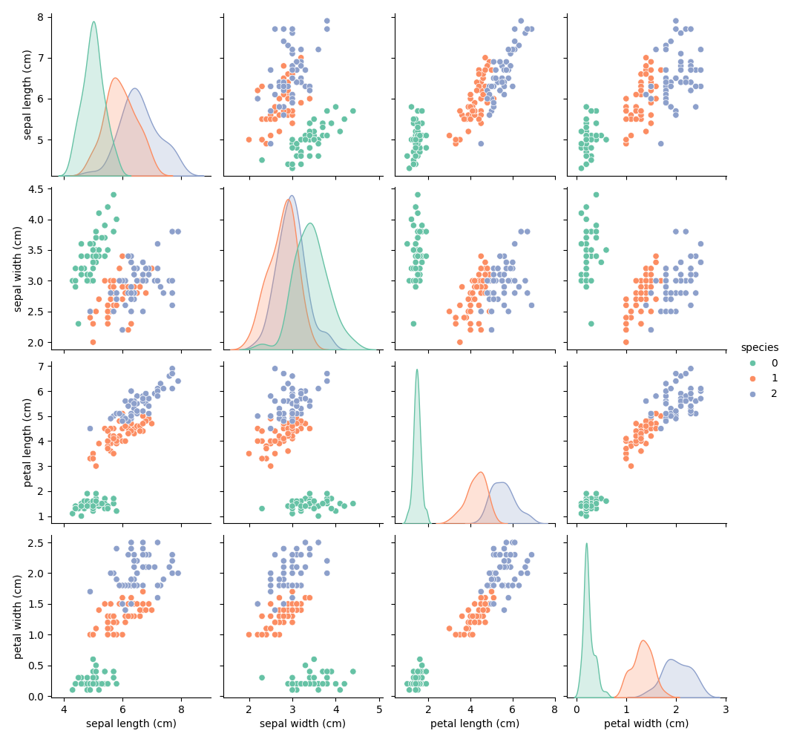

Iris Flower Classifier

My first ML project where I trained a Random Forest Classifier to predict iris flower species based on petal and sepal dimensions.

 Tools Used
- Python
- Pandas, Seaborn
- scikit-learn
- Google Colab

Accuracy
Achieved 96% accuracy on the test set!

 Visualization

What I learned
- How to train a classifier on real-world data
- Visualizing using pairplots

